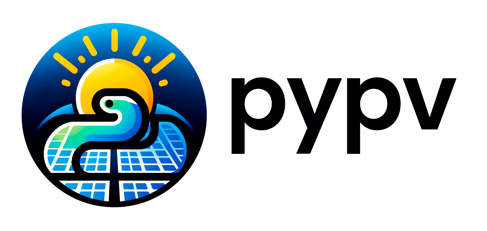

<div align="center">
    <a href="https://github.com/patrickpasquini/PyPv" target="_blank">
      
    </a>
</div>

<div align="center">
    <a href="https://pypi.org/project/pypv/" target="_blank">
      
    </a>
    <a href="https://pypi.org/project/pypv/" target="_blank">
      
    </a>
    <!-- <a href="LINK_TO_YOUR_COVERAGE_REPORT" target="_blank">
      
    </a> -->
    <!-- <a href="https://pepy.tech/project/pypv" target="_blank">
      
    </a> -->
</div>

---

**Documentation**: <a href="https://github.com/patrickpasquini/PyPv" target="_blank">https://github.com/patrickpasquini/PyPv</a>

**Source Code**: <a href="https://github.com/patrickpasquini/PyPv" target="_blank">https://github.com/patrickpasquini/PyPv</a>

---

**PyPv** is a modern Python library designed for simplified sizing of photovoltaic power plants. It helps in determining the most efficient way to set up strings in combination with inverters and modules, along with other functionalities that are described in the documentation.

By using **PyPv**, you can effortlessly plan and optimize solar power systems, allowing for a more efficient and cost-effective setup. This library simplifies the entire process of defining and configuring photovoltaic systems and components.

## Key Features

- **Simplified Photovoltaic System Sizing**: Automate the calculations for sizing solar power systems.
- **String Configuration Optimization**: Determine the best way to arrange photovoltaic strings for maximum efficiency.
- **Inverter and Module Combination**: Find the optimal combination of inverters and modules for your solar power setup.
- **Additional Functionalities**: Explore more features detailed in the library's documentation.

## Installation

You can install `PyPv` using pip:

```bash
pip install pypv
